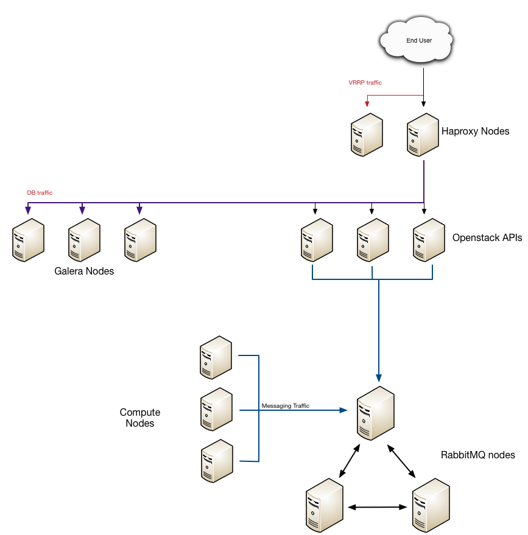

# CSC DCAF Red Hat Enterprise Linux OpenStack Platform Deployment Automation

## Introduction
The RHEL-OSP module consists of ansible playbooks, ansible modules, and Heat
templates that are designed to create a highly available Red Hat OpenStack
Cluster.  This module is designed to allow for flexibility in service placement
on a given node.  

## Requirements
- [Ansible 2.0](https://github.com/ansible/ansible)
- *Heat 2014.2*  *(this is required to use the testing playbooks)*

## Overview
This module deploys a Red Hat Enterprise Linux OpenStack Platform, that uses
keepalived and haproxy to provide a highly available (HA) OpenStack cluster that
is based off the reference architecture provided by [Red Hat](www.redhat.com),
and the [RDO project](www.rdoproject.org). The overall deployment can be broken
down into 4 different types of nodes.

- haproxy nodes, these can be physical or VMs, and they run keepalived and
  haproxy providing a VIP for services to use.
- controller nodes, these can be physical or vms, they run all the APIs and
  support services needed to run the Openstack Cluster
- network nodes, these can be physical or vms, these run the neutron agents, as
  to seperate them from the control plane.
- compute nodes, These need to be physical, so to take advantage of hardware
  acceleration for hosting VMs under KVM.

## Usage
Each playbook can be used on its own to install a particular part of Openstack,
ie `keystone.yml` will install the keystone service. The intention is that
`site.yml` is used as to install all parts of the openstack environment.

**note**
This module does not install a volume service.  It is intended that this module
is paired with the [scaleIO playbook](https://github.com/csc/ansible-scaleio) to
provide cinder volume services.

## Inventory
The project inventory must be modified for your deployment environment. The
specific files that need to modified are listed below.

### group_vars
#### all.yml

```yaml
# subscription manager vars:
# RHN credentials to register systems
rhn_user: rhn-username
rhn_pass:  rhn-password
# Specify a subscription pool name to consume. Regular expressions accepted.
pool: Openstack
openstack_release: 'juno'
offline: false
ceilometer_db: mariadb
use_pacemaker: false
# VIPs
vip_servername: "{{ haproxy_vip }}"
haproxy_vip: 192.168.101.2
```

#### neutron.yml

```yaml
neutron_ovs_bridges:
  - ovs_bridge: br-ex
    physical_net: eth3
```
* this defines the external bridge that will be used for OpenStack L3 traffic *

#### swift.yml

```yaml
# interface for swift services (internal) to listen on.  If different between
# swift storage and swift proxy, create new group vars file for each of the
# mentioned groups.
mgmt_if: eth0
# interface for rsync to use to replicated storage nodes. to listen on.  If
# different between swift storage and swift proxy, create new group vars file
# for each of the mentioned groups.
rsync_if: eth2
```

### host_vars
Each of the different node types are listed below.  The important part for each
of these is the difference in network interfaces.

#### haproxy nodes:

```
dns_if: eth1
mgmt_if:
  ipaddr: 192.168.100.11
  netmask: 255.255.255.0
  gateway: 192.168.100.1
  dns1: 192.168.70.3

control_if:
  device: eth1
  ipaddr: 192.168.101.11
  netmask: 255.255.255.0


keepalived_if:
  ipaddr: 172.16.27.3
  netmask: 255.255.255.0
```

#### controller nodes:

```
virt: true
dns_if: eth1

mgmt_if:
  device: eth0
  ipaddr: 192.168.100.21
  netmask: 255.255.255.0
  gateway: 192.168.100.1
  dns1: 8.8.8.8

control_if:
  device: eth1
  ipaddr: 192.168.101.21
  netmask: 255.255.255.0

sql_rep_if:
  device: eth2
  ipaddr: 172.16.28.4
  netmask: 255.255.255.0
```

#### network nodes:

```
virt: true
dns_if: eth1

mgmt_if:
  device: eth0
  ipaddr: 192.168.100.31
  netmask: 255.255.255.0
  gateway: 192.168.100.1
  dns1: 8.8.8.8

control_if:
  device: eth1
  ipaddr: 192.168.101.31
  netmask: 255.255.255.0

datanet_if:
  device: eth2
  ipaddr: 172.16.23.31
  netmask: 255.255.255.0

ext_if:
  device: eth3
  ipaddr: 10.10.0.31
  netmask: 255.255.255.0
```

#### compute nodes:

```
virt: true
dns_if: eth1
nova_virt_type: qemu

mgmt_if:
  device: eth0
  ipaddr: 192.168.100.51
  netmask: 255.255.255.0
  gateway: 192.168.100.1
  dns1: 8.8.8.8

control_if:
  device: eth1
  ipaddr: 192.168.101.51
  netmask: 255.255.255.0

datanet_if:
  device: eth2
  ipaddr: 172.16.23.51
  netmask: 255.255.255.0

scaleio_if:
  device: eth3
  ipaddr: 172.16.26.51
  netmask: 255.255.255.0
```


## HA Architecture
HA is implemented in the following fashion:




## Flow chart of playbook


